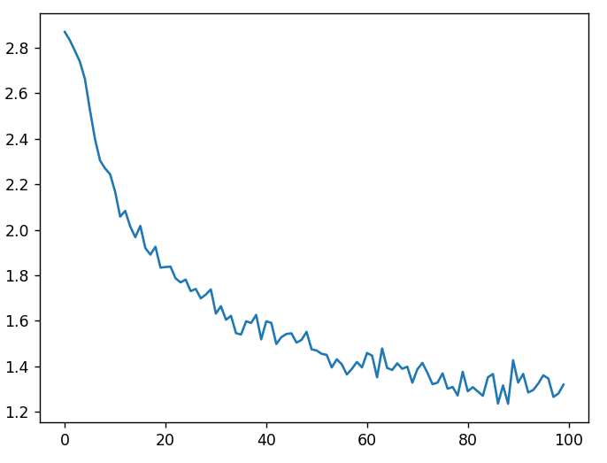

# predicting-name-nationality-using-RNN
In this repo I make an RNN model that predicts a nationality of a human name.
this image shows the decrease in the loss during training over 100,000 training steps.

